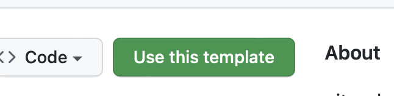

# python_boilerplate

This repo contains a GitHub template for a complete Python project with support for:

- using virtual environments
- using separate requirements files for project and dev dependencies
- installing the project as a local _editable_ package to easily import it in any test
  file without having to use `sys.path.append()`
- efficiently working in [Gitpod](https://gitpod.io) with a pre-configured
  `[gitpod. yml`](gitpod.yml) file and pre-builds
- using [black](https://black.readthedocs.io/en/stable/) for code formatting
  manually and/or via [pre-commit](https://pre-commit.com) and/or with a GitHub
  Actions workflow that checks the code formatting at each push and pull-request on the
  `main` branch.
- using GitHub actions workflows to:
  - parse the title of each pull request on the `main` branch and extract new version
    number (`v*.*.*`)
  - check that the [`CHANGELOG.md`](CHANGELOG.md) file has been updated with the new version number
  - check that the [`setup.py`](setup.py) file has been updated with the new version number
  - create a git tag on `main` once the pull-request is merged

This is a list of the current features implemented, more will come with time.

## How to use this template
1. Click on the `Use this template` button on the
GitHub page of this repo.

> Tip: Don't use "Include all branches" option as it will create several branches
> that do not have common origins. You can just create a new branch called `main`

2. If you want to use the template on a local machine, clone the repo and setup
   everything by running `bash setup_workspace.sh`. This will create a virtual
   environment, install all the dependencies and install the project as a local
   editable package.
3. If you want to use the template on Gitpod, just open the repo in Gitpod and
   everything will be set up automatically.
4. Rename the `python_boilerplate` directory to the name of your project and update
   the `setup.py` file accordingly.
